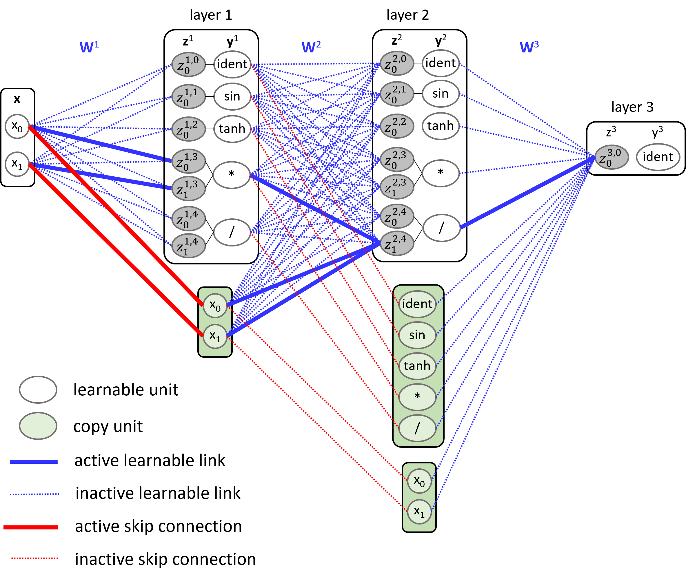

[🌐 Project Page](https://jirkakubalik.github.io/ANSR/)

# Asynchronous Neuro-Evolutionary Symbolic Regression with Maturity-Based Replacement

ANSR is an asynchronous neuro-evolutionary method for symbolic regression in which mathematical expressions are represented by feedforward neural networks (see Figure below). It combines evolutionary search over network master topology with continuous gradient-based tuning of model parameters.

Unlike standard neuro-evolutionary approaches, ANSR does not judge new offspring only by their immediate performance after mutation or crossover. Since structural changes often require additional coefficient tuning, promising models may otherwise be discarded too early. ANSR addresses this with lifelong asynchronous refinement and maturity-based replacement: offspring are allowed to develop in parallel with the population and are compared with individuals at a similar stage of refinement. This makes the search more patient, preserves structurally novel candidates longer, and better separates topology quality from short-term parameter readiness.

<p align="center">
  
</p>

---

## ANSR key concepts
Candidate expressions are represented as neural networks composed of layers of units, where each unit represents a mathematical operation (e.g., addition, multiplication, sine, cosine). The master topology defines the structure of the individuals. It specifies the number of layers and the types of units used in each layer.
Additionally, identity connections between layers can be enabled, allowing layers to be skipped. 

The method maintains three populations of individuals: *mainpop*, *offsprings*, and *archive*. The first two populations have fixed size, whereas *archive* is not size-limited. The *mainpop* contains individuals that are used to generate new individuals via crossover and mutation. They are initially generated randomly based on the specified master topology. The *offsprings* population contains newly created individuals. The *archive* contains non-dominated solutions among all solutions generated up to the given point in the computation. Individuals in this population do not actively participate in the optimization process.

In ANSR, individuals are regularly refined via backpropagation in batches, where the number of optimization iterations is a method parameter. They are kept in the population until it becomes evident that an offspring individual should be promoted to the main population. An individual from either the main population or the offspring population is discarded when it no longer shows potential for further improvement, according to the replacement rules.

### Units
The individuals are represented as neural networks composed of layers of units. Each unit represents a mathematical operation.
The following units are implemented in the `SRUnits.py` file:
- `UnitMultiply`: multiplication
- `UnitDivide`: division
- `UnitReciprocal`: reciprocal
- `UnitSin`: sine
- `UnitCos`: cosine
- `UnitTanh`: hyperbolic tangent
- `UnitArcTan`: arctangent
- `UnitSquare`: square
- `UnitSqrt`: square root
- `UnitCube`: cube
- `UnitSign`: sign
- `UnitIdent`: identity

### Master topology file

One line in the file represents one layer, followed by another line specifying whether skip connections are allowed.
In the output layer, there must always be exactly one identity unit. 

Example master topology file:

    UnitMultiply:4, UnitIdent:4    # 1st hidden layer with 4 multiplication and 4 identity units
    identities:True                # allow skip connections from the input to this layer

    UnitMultiply:4, UnitIdent:4    # 2nd hidden layer with 4 multiplication and 4 identity units
    identities:true                # allow skip connections from the input and the 1st hidden layer to this layer

    UnitIdent:1                    # output layer with a single identity unit
    identities:false               # do not allow skip connections

The example master topology defines a network with 2 hidden layers and 1 output neuron which is a simple identity. The hidden layers consist of 4 multiplication units and 4 identity units. Skip connections are allowed from the input to both hidden layers, and from the first hidden layer to the second hidden layer.

### Constraints
Constraints can be defined in a JSON file. Once specified, a predefined number of data points is generated, 
and the RMSE of the constraints is computed on these points.

**Available constraints types**
- `constraint_gtvalue`: The function output must be greater than a specified value. 
- `constraint_ltvalue`: The function output must be less than a specified value.
- `constraint_exactvalue`: The function output must be equal to a specified value.
- `constraint_concave_down`: The function must be concave down with respect to a specified variable. 
- `constraint_decreasing`: The function must be monotonically decreasing with respect to a specified variable.
- `constraint_decreasing_positive_second_derivative`: The function must be decreasing and must also have a positive 
second derivative with respect to a specified variable.
- `constraint_increasing`: The function must be monotonically increasing with respect to a specified variable.
- `constraint_invariant`: The function output must be equal to a specified state variable.
- `constraint_resistors_diagonal`: The function output on the diagonal must be half of the partial resistor.
- `constraint_resistors_ltinput`: The function output must be less than either of the two inputs.
- `constraint_symmetry2vars`: The function must be symmetric with respect to two specified variables.
- `constraint_odd_symmetry`: The function must be odd-symmetric with respect to a specified variable.

**JSON file structure**

The JSON file contains a list of constraints, each defined by its parameters:
- `class`: The type of constraint (from the list above).
- `weight`: The relative importance of the constraint in the overall evaluation.
- `domain`: The domain used to generate sample points for evaluating the constraint.
- `nbOfSamples`: The number of sample points to generate for this constraint.
- `args`: Additional arguments required by the constraint.

Snippet of the JSON file, that defines two constraints - constraint_gtvalue and constraint_resistors_diagonal:

    {
      "constraints": 
      [
        {
          "class": "constraint_gtvalue",
          "weight": 1.0,
          "domain": [[[0.001, 40], [0.001, 40]]],
          "nbOfSamples": 50,
          "args": {
            "test_value": 0.0
          }
        },
        {
          "class": "constraint_resistors_diagonal",
          "weight": 1.0,
          "domain": [[[0.001, 40], [0.001, 40]]],
          "nbOfSamples": 50,
          "args": {}
        }
      ] 
    }

---

## Installing ANSR

Navigate to the `source_code` directory and run the following commands.

**Windows**

`python -m venv .venv`  creates a virtual environment

`.venv\Scripts\activate`  activates the virtual environment

`python -m pip install --upgrade pip`

`pip install -r requirements.txt`  installs all required packages

**Linux**

`python3 -m venv .venv`

`source .venv/bin/activate`

`python3 -m pip install --upgrade pip`

`pip install -r requirements.txt`

---

## Running ANSR

From the `source_code` directory, run the program with the following arguments:

### Main arguments with mandatory parameters marked with (*)
- (*) `-t`: master topology file
- &nbsp;&nbsp;&nbsp;&nbsp;&nbsp;`-c`: file with constraints
- (*) `--train_data`: data to use for training
- (*) `--valid_data`: data to use for validation
- (*) `--main_pop_size`: size of the main population
- (*) `--offspring_pop_size`: size of the offspring population
- &nbsp;&nbsp;&nbsp;&nbsp;&nbsp;`--backprop_epoch`: number of backpropagation epochs per iteration
- (*) `-o`: directory where to save results
- &nbsp;&nbsp;&nbsp;&nbsp;&nbsp;`-s`: seed

### Strategy parameters
- `--addNewIndToOffspring`: rules for adding new individuals to the *offspring* with two possible settings
  - `addNewIndToOffspring`: add new individual to the *offspring* only if it is not full
  - `addNewIndToOffspringIfDominates`: add new individual to the *offspring* if it is not full or if it dominates at least one individual in the *offspring*
- `--addOffspringToPopulation`: rules for adding individual from the *offspring* to the *mainpop* with two possible settings
  - `addOffspringToPopulation`: add individual from the *offspring* to the *mainpop* according to the rules described above
  - `addOffspringToPopulationNever`: never add individual from the *offspring* to the *mainpop*
- `--keepIndInMainPopulation`: rules for keeping individual in the *mainpop* with two possible settings
  - `keepIndInMainPopulationAlways`: keep individual in the *mainpop* until it is replaced by individual from the *offspring*
  - `keepIndInMainPopulationConditional`: keep individual in the *mainpop* until it is replaced by individual from the *offspring* or dominated by other individual in the *mainpop*
- `--keepIndInOffspring`: rules for keeping individual in the *offspring* with two possible settings
  - `keepIndInOffspringAlways`: keep individual in the *offspring* until it is moved to the *mainpop*
  - `keepIndInOffspringConditional`: keep individual in the *offspring* until it is moved to the *mainpop* or dominated by other individual in the *offspring* or its performance stopped improving
- `--networkActivityMutation`: rules for network activity mutation with two possible settings
  - `networkActivityMutation`: mutate all elements with certain probability
  - `networkActivityMutationOnlyToInactive`: mutate only active elements with certain probability

### Example command for **nguyen-9c**
`
python Main.py
-t 
topology_sin_cos_square_mult_2layers_2units.txt  
--train_data 
Nguyen-9c_n=100_train.csv  
--valid_data 
Nguyen-9c_n=100_valid.csv  
--main_pop_size 
20  
--offspring_pop_size 
20  
--maxTotalBackprops 
100000  
-o 
results/nguyen-9c
-s 
1
`

---

## Output directory structure

The output directory is organized hierarchically by **seed**, with each seed containing run metadata and saved individuals from both the archive and the main population.

### Top-level layout

- The base directory contains one subdirectory per seed:
  - `seed=0`
  - `seed=1`
  - ...

### Contents of each `seed=*` directory

Each seed directory contains:

- **`archiveIndividuals/`**  
  Individuals belonging to the *archive*.

- **`mainPopulationIndividuals/`**  
  Individuals belonging to the *mainpop*.

- **Run metadata and logs**, such as:
  - `configuration.txt`: the configuration parameters used for the run
  - `initial_population_phase_I.txt`: the initial *mainpop* after first phase of tuning
  - `initial_population_phase_II.txt`: the initial *mainpop* after second phase of tuning
  - `log.txt`: log of the run
  - `population.txt`: the *mainpop*, *archive*, and *offspring* populations during several snapshots of the run

### Snapshot subdirectories

Both `archiveIndividuals/` and `mainPopulationIndividuals/` contain additional subdirectories that represent series of snapshots generated by one of the following quantities:

- **Number of backpropagations used**  
  Example for backprop interval 1000 iterations: `backprops_5400/`, `backprops_6400/`, `backprops_7400/`, ...

- **Number of generated individuals**  
  Example for individual interval 100 ID: `ids_100/`, `ids_200/`, `ids_300/`, ...

- **Elapsed time**  
  Example for time interval 60s: `time_60/`, `time_180/`, `time_240/`, ...

These snapshot directories store the corresponding individuals at that stage of the run.

### File formats

Each snapshot directory contains saved individuals, exported in:

- **MATLAB format**: `.m`
- **Plain text format**: `.txt`

### Example Directory Tree

```text
results/
└── basic-polynom/
    ├── seed=0/
    │   ├── archiveIndividuals/
    │   │   ├── backprops_6400/
    │   │   ├── backprops_7400/
    │   │   ├── ids_100/
    │   │   ├── ids_120/
    │   │   ├── time_180/
    │   │   └── time_301/
    │   ├── mainPopulationIndividuals/
    │   │   ├── backprops_6400/
    │   │   ├── ids_100/
    │   │   └── time_180/
    │   ├── configuration.txt
    │   ├── error.err
    │   ├── initial_population_phase_I.txt
    │   ├── initial_population_phase_II.txt
    │   ├── log.txt
    │   ├── output.out
    │   └── population.txt
    ├── seed=1/
    ├── seed=2/
    ├── seed=3/
    └── ...
```

---

## Citation

If you find this useful, please cite the paper:

```bibtex
@inproceedings{kubalik2026ansr,
  author    = {Kubal{\'\i}k, Ji{\v{r}}{\'\i} and Fu{\v{c}}elov{\'a}, Na{\v{d}}a and Babu{\v{s}}ka, Robert},
  title     = {Asynchronous Neuro-Evolutionary Symbolic Regression with Maturity-Based Replacement},
  booktitle = {Genetic and Evolutionary Computation Conference (GECCO '26)},
  year      = {2026},
  doi       = {10.1145/3795095.3805164}
}
```
=======
Coming soon:
- README
  - brief overview of ANSR principles
  - input data format and constraints
  - output directory structure and file formats
  - an illustrative example of ANSR usage
- Source code
- GECCO’26 experiment setup, data, configuration, and results
